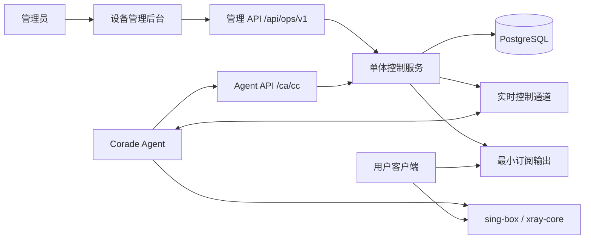
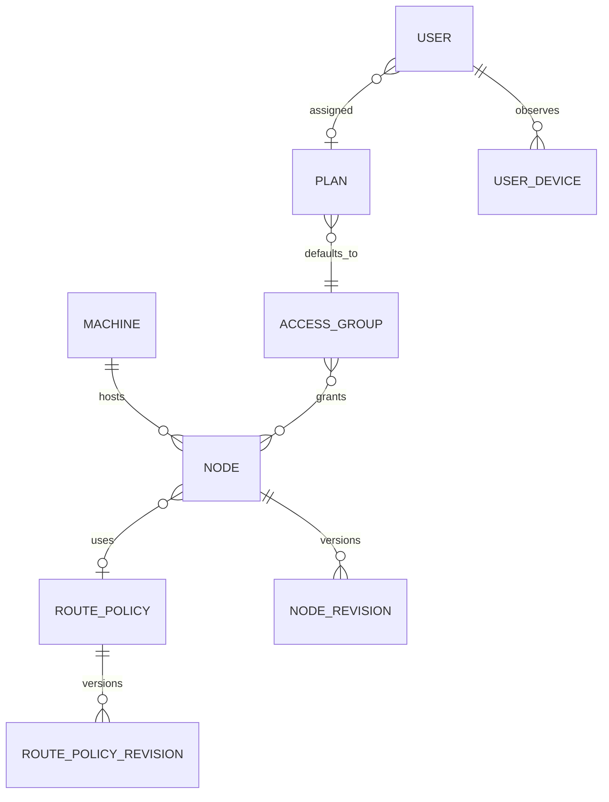

# 设备管理平台项目详情（待确认）

> 文档状态：方案确认稿
> 更新日期：2026-07-29
> 当前阶段：仅确认范围与架构，尚未开始编码
> 项目名称：CPanel

## 1. 项目概述

本项目建设一套面向 Corade 的轻量设备管理平台。平台负责管理服务器、节点、节点访问权限、路由策略、套餐、用户和系统参数，并向 Corade 提供独立的控制协议。

它不是 Xboard 的复制品，也不通过换名称复用 Xboard 的后台结构。平台将拥有：

- 自己的管理端 API；
- 自己的 Corade Agent API；
- 以服务器和节点生命周期为核心的后台；
- 独立的鉴权、错误码、资源模型和实时事件命名；
- 仅保留运行节点所必需的功能，不引入大部分商业系统能力。

## 2. 已确认目标

1. 构建一个可以直接对接 Corade 的后端控制服务。
2. 参考 Corade 实际需要的数据结构，但不复刻 Xboard API。
3. 必要时修改 Corade，使其原生接入本平台的新协议。
4. 提供服务器、节点、权限组、路由、套餐、用户和系统设置管理。
5. 后台以“设备管理平台”为产品定位，突出运行状态、配置和运维动作。
6. 保持部署和维护简单，优先采用单体服务和少量外部依赖。

## 3. 首期不做

以下内容不属于首期范围：

- 订单、支付、退款、发票和财务对账；
- 优惠券、邀请返利、分销和代理商体系；
- 营销活动、公告中心、工单和客服系统；
- 多租户 SaaS、商户入驻和白标销售；
- 自动购买或续费套餐；
- 直接保存服务器 SSH 密码并远程执行任意命令；
- 微服务拆分、消息队列和复杂的大数据分析平台。

套餐在本项目中表示“资源与访问策略模板”，由管理员手动分配给用户，不代表可购买商品。

## 4. 核心术语

| 名称 | 定义 |
| --- | --- |
| 服务器 / Machine | 安装并运行 Corade 的物理机或虚拟机，一台服务器可承载多个节点。 |
| 节点 / Node | 由 Corade 启动的一个逻辑入站服务，包含协议、端口、传输、TLS、路由等运行配置。 |
| 权限组 / Access Group | 一组允许用户访问的节点，用于隔离区域、用途或服务等级。 |
| 路由策略 / Route Policy | 可复用的出站、匹配规则和动作集合，可绑定到多个节点。 |
| 套餐 / Plan | 用户的流量、速率、设备数、有效期和权限组默认值。 |
| 管理员 / Admin | 唯一可以登录管理后台、维护平台资源的账号角色。 |
| 用户 / User | 被下发到 Corade、实际使用节点服务的账号，只能访问订阅。 |
| 朋友 / Friend | 与用户具有相同系统访问边界的账号分类，只能访问订阅。 |
| Agent 凭据 | Corade 服务器连接控制平面的机器级密钥，只在创建或轮换时展示一次。 |

权限组用于控制用户和朋友能够访问哪些节点，不等同于账号角色。用户与朋友的系统权限相同，套餐、额度和节点权限可以分别配置；只有管理员能够访问后台。

## 5. Corade 现状结论

根据当前 `coradem` 代码，已有能力可以直接作为新控制协议的实现基础：

- 支持单节点、多节点和机器模式；
- 机器模式可动态发现绑定节点，并自动启动或停止对应服务；
- 支持 REST 拉取、ETag 缓存、WebSocket 推送和断线重连；
- 能热更新节点配置、用户全量列表和用户增量变化；
- 能上报机器状态、节点状态、用户流量、在线 IP 和设备快照；
- 已抽象 `controlplane`，适合新增本平台专用实现；
- 节点配置已覆盖协议、传输、TLS/证书、自定义出站和路由规则。

当前接口仍使用旧面板路径和查询参数鉴权，因此本项目不能仅在服务端伪装兼容，必须为 Corade 增加新的平台适配器。

## 6. 总体架构



推荐首期采用模块化单体：

- 一个 Go 服务承载管理 API、Agent API、WebSocket、定时任务和静态后台；
- 一个 PostgreSQL 数据库；
- React 后台构建后嵌入 Go 二进制或由同一服务托管；
- 不要求 Redis、消息队列和独立任务服务；
- 单机部署即可运行，后续需要多实例时再增加共享事件总线。

## 7. 功能模块

### 7.1 总览

总览不是销售仪表盘，而是运行态工作台，包含：

- 在线、离线、异常服务器数量；
- 运行中、待发布、故障节点数量；
- 最近 24 小时流量与在线用户趋势；
- CPU、内存、磁盘或连接数异常的服务器；
- 最近配置发布、Agent 断连和鉴权失败；
- 可直接进入故障服务器或节点的待处理列表。

### 7.2 服务器管理

服务器表示一个 Corade 机器实例。

主要能力：

- 新增、编辑、禁用和归档服务器；
- 设置名称、区域、IP/域名、标签和备注；
- 生成一次性 Agent 凭据和安装配置；
- 查看 Agent 版本、内核类型、启动时间和最后心跳；
- 查看 CPU、内存、Swap、磁盘、网络速率和承载节点；
- 轮换或吊销 Agent 凭据；
- 查看连接历史、错误和最近事件；
- 手动触发重新同步；
- 离线判断阈值由系统设置统一控制。

首期采用“创建服务器后复制安装命令”的接入方式，不保存 SSH 密码，也不在后台直接登录服务器。

### 7.3 节点管理

节点是绑定到服务器的逻辑服务，不与服务器混为同一资源。

主要能力：

- 创建、复制、编辑、启用、停用和迁移节点；
- 选择所属服务器、协议、监听地址、端口和内核；
- 配置网络传输、TLS/Reality、证书、混淆和多路复用；
- 绑定权限组和路由策略；
- 在发布前执行字段校验、端口冲突检查和内核兼容性检查；
- 保存草稿、发布新版本、查看当前运行版本和回滚；
- 查看连接数、流量、在线用户、错误和最后上报时间；
- 配置变更通过实时通道推送，Agent 断线时保留待同步状态。

首期协议范围以 Corade 当前内核实现为准：

- sing-box：VMess、VLESS、Trojan、Shadowsocks、Hysteria/Hysteria2、TUIC、Naive、AnyTLS、Mieru、SOCKS、HTTP；
- Xray：VMess、VLESS、Trojan、Shadowsocks、Hysteria、SOCKS、HTTP；
- 传输与内核不兼容时，后台必须在发布前阻止或明确提示自动切换。

### 7.4 权限组管理

权限组解决“哪些用户可以访问哪些节点”。

主要能力：

- 创建权限组并维护名称、状态和备注；
- 将一个或多个节点加入权限组；
- 查看使用该权限组的套餐和用户数量；
- 删除前进行引用检查；
- 节点加入或移出后，只向受影响的 Corade 实例推送用户变化；
- 默认提供一个可重命名的基础权限组，但不自动授予所有新节点。

### 7.5 路由管理

路由模块分为“出站”和“策略”两个层次：

- 出站定义 `direct`、`block`、VMess、VLESS、Trojan、Shadowsocks、SOCKS、HTTP、WireGuard 等目标；
- 路由策略由有序规则组成，每条规则包含匹配条件和动作；
- 匹配条件支持域名、域名后缀、IP/CIDR、目标端口、网络类型、来源 CIDR 和来源端口；
- 动作支持直连、阻断或转发到指定出站；
- 策略可被多个节点复用，发布后生成不可变版本；
- 删除出站前检查所有路由引用；
- 普通模式使用表单化规则编辑器，高级模式允许查看和编辑内核原生 JSON；
- 发布前按 sing-box/Xray 分别编译并校验，避免把不兼容配置推给 Agent。

路由优先级建议固定为：节点专属规则、绑定策略、系统拦截规则、默认直连。最终顺序需在实现前确认。

### 7.6 套餐管理

套餐是用户权益模板，不包含价格、订单和支付。

主要能力：

- 设置名称、状态、默认权限组；
- 设置总流量额度和重置周期；
- 设置上传/下载或统一速率限制；
- 设置同时在线设备数；
- 设置默认有效天数或固定到期时间规则；
- 查看使用人数；
- 停用套餐时不自动停用已有用户；
- 用户可使用少量单独覆盖值，空值则继承套餐。

### 7.7 用户管理

主要能力：

- 创建、编辑、启用、暂停和归档用户；
- 管理用户名/邮箱、内部备注、UUID 和订阅令牌；
- 分配套餐并设置到期时间；
- 单独覆盖流量、速度、设备数或权限组；
- 查看已用流量、剩余额度、在线 IP、设备和最近活动；
- 重置流量、踢下线、清理设备、轮换 UUID 或订阅令牌；
- 用户状态、套餐或权限变化后向相关节点推送增量更新；
- 提供 CSV 批量导入导出，首期不实现复杂用户标签自动化。

为了让用户真正使用节点，首期包含最小订阅能力：使用不可猜测的订阅令牌输出当前可访问节点，输出格式仅支持 Clash Meta。

### 7.8 系统设置

设置按领域分区，不使用一个无限增长的键值表页面。

| 分区 | 设置内容 |
| --- | --- |
| 站点 | 平台名称、站点 URL、Logo、时区、默认语言、页脚文本。 |
| Agent 接入 | 外部 API 地址、心跳间隔、离线阈值、推送开关、REST 兜底间隔、最大消息大小。 |
| 安全 | 会话有效期、密码策略、登录失败锁定、允许的代理来源、Agent 密钥轮换策略。 |
| 节点默认值 | 默认内核、监听地址、上报间隔、默认路由策略、证书模式。 |
| 证书与 DNS | ACME 邮箱、DNS Provider 及其密钥、HTTP-01 端口。 |
| 订阅 | 订阅基础地址、缓存时间、令牌失效策略、支持的输出格式。 |
| 数据保留 | 指标、在线设备、流量明细和审计日志保留天数。 |

敏感值必须加密存储，读取接口只返回是否已配置和脱敏摘要；修改时不回显原值。

### 7.9 账号角色与审计

系统固定使用三种账号角色：

| 角色 | 定位 | 权限边界 |
| --- | --- | --- |
| `admin` / 管理员 | 平台管理者 | 唯一可以登录管理后台的角色，拥有服务器、节点、权限组、路由、套餐、账号、系统设置、Agent 凭据、数据导入和备份恢复等全部管理权限。 |
| `user` / 用户 | 普通订阅账号 | 不能登录或访问后台，只能通过自己的订阅令牌获取 Clash Meta 订阅；实际节点范围、流量、速率和设备限制由套餐及账号覆盖值决定。 |
| `friend` / 朋友 | 朋友订阅账号 | 不能登录或访问后台，只能通过自己的订阅令牌获取 Clash Meta 订阅；系统访问权限与用户相同，作为独立账号分类便于管理员识别和配置权益。 |

管理员是唯一后台角色，首期不提供分级管理员、自定义角色或逐项 RBAC。管理 API 必须拒绝用户和朋友的订阅凭据，订阅接口也不得返回任何后台数据。

所有管理员登录、凭据轮换、配置发布、账号停用和敏感设置修改必须写入审计日志。

## 8. 后台信息架构与界面方向

### 8.1 导航

```text
总览
基础设施
  ├─ 服务器
  └─ 节点
访问控制
  ├─ 用户
  ├─ 套餐
  └─ 权限组
流量策略
  ├─ 路由策略
  └─ 出站
系统
  ├─ 系统设置
  ├─ 管理员
  └─ 审计日志
```

### 8.2 交互原则

- 采用安静、密集、可扫描的运维控制台，不使用营销型首页或大量装饰卡片；
- 列表是主工作面，支持稳定列宽、筛选、排序、批量操作和保存视图；
- 服务器详情使用“状态、节点、指标、事件、凭据”页签；
- 节点详情使用“运行配置、用户访问、路由、指标、版本”页签；
- 创建节点采用分步表单，但编辑时直接进入配置工作台；
- 重要状态同时使用图标、文本和颜色，不能只靠颜色区分；
- 危险操作显示资源名和影响范围，发布操作展示配置差异；
- 长 JSON 仅出现在高级编辑器，常用参数使用类型明确的表单控件；
- 桌面端优先，平板可完成查看和基础操作，手机端只保证监控与紧急停用可用。

### 8.3 独特方向

后台的识别点是“机器—节点—访问范围—路由”的关系视图：

- 总览直接呈现服务器和节点拓扑，而不是收入、订单或用户增长；
- 从服务器可展开其节点，从节点可追溯权限组、套餐与在线用户；
- 每次配置发布都显示受影响的服务器、节点和用户范围；
- 页面中的主要动作围绕接入、发布、同步、迁移、轮换和诊断。

视觉品牌、正式色彩和字体尚未冻结，待项目范围确认后单独出设计方案。

## 9. API 设计

### 9.1 接口分区

| 接口 | 用途 | 鉴权 |
| --- | --- | --- |
| `/api/ops/v1/*` | 管理后台使用 | HttpOnly 会话 Cookie + CSRF |
| `/ca/cc/*` | Corade Agent 使用 | `Authorization: Bearer <agent_token>` |
| `/ca/x/{完整订阅令牌}` | 用户订阅输出 | URL 中的完整订阅令牌 |
| `/health/live` | 进程存活检查 | 无敏感信息 |
| `/health/ready` | 数据库与迁移就绪检查 | 可限制来源 |

管理 API 与 Agent API 使用完全不同的认证域，不允许后台会话调用 Agent 接口，也不允许 Agent 密钥调用管理接口。

### 9.2 管理 API 资源

```text
POST   /api/ops/v1/sessions
DELETE /api/ops/v1/sessions/current
GET    /api/ops/v1/overview

GET|POST        /api/ops/v1/machines
GET|PATCH       /api/ops/v1/machines/{id}
POST            /api/ops/v1/machines/{id}/credentials
POST            /api/ops/v1/machines/{id}/sync

GET|POST        /api/ops/v1/nodes
GET|PATCH       /api/ops/v1/nodes/{id}
POST            /api/ops/v1/nodes/{id}/validate
POST            /api/ops/v1/nodes/{id}/publish
POST            /api/ops/v1/nodes/{id}/rollback

GET|POST        /api/ops/v1/access-groups
GET|PATCH       /api/ops/v1/access-groups/{id}

GET|POST        /api/ops/v1/outbounds
GET|PATCH       /api/ops/v1/outbounds/{id}
GET|POST        /api/ops/v1/route-policies
GET|PATCH       /api/ops/v1/route-policies/{id}
POST            /api/ops/v1/route-policies/{id}/validate
POST            /api/ops/v1/route-policies/{id}/publish

GET|POST        /api/ops/v1/plans
GET|PATCH       /api/ops/v1/plans/{id}

GET|POST        /api/ops/v1/users
GET             /api/ops/v1/users/{id}/subscription
GET|PATCH|DELETE /api/ops/v1/users/{id}
POST            /api/ops/v1/users/{id}/reset-traffic
POST            /api/ops/v1/users/{id}/disconnect

GET|PATCH       /api/ops/v1/settings/{section}
GET              /api/ops/v1/audit-events
```

删除操作优先使用归档或禁用状态。只有无引用的草稿资源允许永久删除。

### 9.3 管理 API 响应约定

```json
{
  "data": {},
  "meta": {
    "request_id": "req_01J..."
  },
  "error": null
}
```

错误响应示例：

```json
{
  "data": null,
  "meta": {
    "request_id": "req_01J..."
  },
  "error": {
    "code": "NODE_PORT_CONFLICT",
    "message": "端口 443 已被当前服务器上的其他节点使用",
    "fields": {
      "server_port": "conflict"
    }
  }
}
```

列表统一使用游标分页，筛选参数保持资源化，不照搬旧面板的参数名称。

### 9.4 Agent API

```text
POST /ca/cc/ws
GET  /ca/cc/fwq/jd
GET  /ca/cc/jd/{jdbh}/pz
GET  /ca/cc/jd/{jdbh}/yh
GET  /ca/cc/bg?yb={yb}
POST /ca/cc/yc
POST /ca/cc/fwq/xt
GET  /ca/cc/td        # WebSocket Upgrade
```

路径缩写统一使用中文拼音首字母：

| 缩写 | 中文含义 |
| --- | --- |
| `ca` | Agent 接口根路径标识，替代 `api`。 |
| `cc` | 控制通道根路径标识，替代 `control`。 |
| `ws` | 握手。此处不表示 WebSocket。 |
| `fwq` | 服务器。 |
| `jd` | 节点。 |
| `jdbh` | 节点编号。 |
| `pz` | 配置。 |
| `yh` | 用户。 |
| `bg` | 变更。 |
| `yb` | 游标。 |
| `yc` | 遥测。 |
| `xt` | 心跳。 |
| `td` | 通道，即 WebSocket 实时通道。 |

设计原则：

- Agent Token 直接绑定服务器，不再由客户端提交 `machine_id + token` 组合；
- Token 不放在 URL 查询参数，REST 和 WebSocket 都通过请求头认证；
- 服务端返回 `protocol_version` 和能力列表，便于后续平滑升级；
- `/ca/cc/bg` 使用单调递增游标作为 REST 兜底，不依赖多个资源各自维护 ETag；
- 所有下发内容带 `revision`，Agent 重连后可判断是否需要替换本地状态；
- `/ca/cc/yc` 支持批量提交并带幂等键，避免断线重试导致重复流量计数。

握手响应示例：

```json
{
  "protocol_version": "1.0",
  "machine": {
    "id": "mch_01J...",
    "name": "Hong Kong Edge 01"
  },
  "stream": {
    "enabled": true,
    "url": "wss://panel.example.com/ca/cc/td"
  },
  "intervals": {
    "heartbeat_seconds": 15,
    "telemetry_seconds": 60,
    "fallback_pull_seconds": 60
  },
  "cursor": "18421"
}
```

### 9.5 实时事件

服务端下发：

| 事件 | 用途 |
| --- | --- |
| `machine.nodes.replace` | 机器绑定节点发生变化。 |
| `node.spec.replace` | 替换某个节点的运行配置。 |
| `node.members.replace` | 替换某个节点的完整用户集合。 |
| `node.members.patch` | 增量添加、更新或移除用户。 |
| `node.devices.replace` | 同步用户全局设备状态。 |
| `agent.command.sync` | 要求 Agent 立即执行一次完整同步。 |

Agent 上报：

| 事件 | 用途 |
| --- | --- |
| `agent.heartbeat` | Agent 与机器状态。 |
| `node.telemetry` | 节点连接、流量与运行指标。 |
| `node.devices` | 节点观察到的用户设备/IP。 |
| `agent.command.result` | 返回同步或配置应用结果。 |

统一信封：

```json
{
  "id": "evt_01J...",
  "type": "node.spec.replace",
  "revision": 42,
  "occurred_at": "2026-07-29T12:00:00Z",
  "data": {}
}
```

## 10. Corade 修改方案

不建议让新后端实现旧接口。推荐在 Corade 内新增专用控制平面适配器：

1. 新增 `internal/platformclient`，实现新的 REST、WebSocket、鉴权和事件信封。
2. 新增 `DevicePlatformControlPlane`，复用现有 `controlplane` 接口。
3. 将 Agent 下发 DTO 转换为现有 `model.NodeSpec` 和 `model.UserSpec`，内核层保持不变。
4. 配置文件新增控制平面模式和 Agent Token 环境变量引用。
5. 机器编排继续复用现有动态节点生命周期管理，但节点发现改用新路径。
6. Agent 上报增加事件 ID、revision 和幂等键。
7. 新增协议契约测试，后端与 Corade 共用版本化 JSON 样例。

建议的新配置：

```yaml
control:
  mode: "device-platform"
  url: "https://panel.example.com"
  token_env: "CORADE_AGENT_TOKEN"

kernel:
  type: "singbox"
  config_dir: "/etc/corade"
```

旧接口处理有两个可选策略：

- 推荐：保留为显式 `legacy` 模式一个过渡版本，新安装默认使用 `device-platform`；
- 激进：直接删除旧接口客户端，只支持新平台，代码更干净但无法回退。

这项选择需要在编码前确认。

## 11. 数据模型

| 表 / 聚合 | 关键内容 |
| --- | --- |
| `admins` | 管理员账号、状态、密码摘要和最后登录。 |
| `admin_sessions` | 管理员后台会话、过期时间、撤销时间和设备摘要。 |
| `machines` | 名称、区域、地址、状态、版本、能力、最后心跳。 |
| `machine_credentials` | Token 摘要、前缀、创建/过期/撤销时间，不保存明文 Token。 |
| `nodes` | 所属机器、协议、端口、内核、状态、当前 revision。 |
| `node_revisions` | 不可变配置快照、校验结果、发布人和发布时间。 |
| `access_groups` | 权限组基本信息。 |
| `access_group_nodes` | 权限组与节点关联。 |
| `outbounds` | 可复用出站定义和内核兼容信息。 |
| `route_policies` | 路由策略基本信息和当前 revision。 |
| `route_policy_revisions` | 不可变路由规则快照。 |
| `plans` | 权限组、流量、速率、设备数和有效期默认值。 |
| `users` | `user` 或 `friend` 角色、身份、UUID、订阅 Token 摘要、套餐、覆盖值、状态和到期时间。 |
| `user_devices` | 用户、节点、IP、首次/最后出现时间和在线状态。 |
| `traffic_daily` | 用户与节点维度的日上传/下载聚合。 |
| `machine_metrics` | 机器短期指标采样或聚合。 |
| `node_metrics` | 节点短期指标采样或聚合。 |
| `settings` | 分区配置、版本和是否敏感。 |
| `audit_events` | 管理员、动作、资源、变更摘要、IP 和时间。 |

关系简图：



## 12. 推荐技术栈

### 后端

- Go；
- `net/http` + `chi` 路由；
- PostgreSQL；
- `pgx` + `sqlc` 管理显式 SQL；
- `goose` 管理数据库迁移；
- Gorilla WebSocket 或 `coder/websocket`；
- 结构化 JSON 日志；
- OpenAPI 3.1 作为管理 API 契约。

### 前端

- React + TypeScript + Vite；
- TanStack Router、TanStack Query 和 TanStack Table；
- React Hook Form + Zod；
- 基础组件采用可定制的无头组件方案，避免生成通用模板式后台；
- Lucide 图标；
- 构建产物由 Go 服务托管。

### 为什么这样选择

- Go 与 Corade 技术栈一致，便于共享协议样例和校验逻辑；
- 单体部署减少服务编排和故障点；
- PostgreSQL 足以覆盖关系数据、JSON 配置、审计和聚合；
- 显式 SQL 比引入大型 ORM 更容易控制查询和迁移；
- 不引入 Redis，首期实时连接由单实例内存管理。

## 13. 安全要求

- 后台密码使用 Argon2id；
- 后台登录使用 HttpOnly、Secure、SameSite Cookie，会话可主动撤销；
- 状态修改请求校验 CSRF；
- Agent Token 至少 256 bit 随机值，只保存摘要，只展示一次；
- Agent Token 可轮换，新旧 Token 允许短暂重叠；
- Agent 请求实施速率限制、时间偏差检查和请求体上限；
- DNS API Key、证书私钥等使用主密钥加密后入库；
- 日志、审计和错误响应不得记录完整 Token、UUID 密钥或证书私钥；
- 配置发布和回滚必须有审计记录；
- 数据库备份与恢复流程必须在首次生产部署前验证。

## 14. 部署方式

首期推荐 Docker Compose：

```text
device-platform
  ├─ app        Go API + WebSocket + Web UI
  └─ postgres   PostgreSQL
```

同时提供原生单二进制部署能力：

- 环境变量或配置文件指定数据库、监听地址、外部 URL 和主加密密钥；
- 内置数据库迁移命令；
- 提供 `/health/live` 和 `/health/ready`；
- 支持反向代理后的真实 IP 与 HTTPS；
- 提供初始化管理员账号的非交互命令；
- 前端静态文件随二进制发布。

## 15. 关键业务流程

### 15.1 接入服务器

1. 管理员创建服务器记录。
2. 平台生成一次性 Agent Token 和安装命令。
3. 管理员在目标服务器安装 Corade。
4. Corade 完成握手并上报版本与能力。
5. 平台将服务器标记为在线，并允许绑定节点。
6. Token 明文从后台消失，只保留轮换入口。

### 15.2 发布节点

1. 管理员创建或编辑节点草稿。
2. 后端进行字段、内核、端口、出站和路由校验。
3. 后台展示配置差异和影响范围。
4. 管理员确认发布，生成新的不可变 revision。
5. 在线 Agent 立即收到 `node.spec.replace`；离线 Agent 标记待同步。
6. Agent 返回应用结果，失败时平台保留旧运行版本并展示原因。

### 15.3 用户授权变化

1. 管理员修改用户或朋友的套餐、权限组、状态或限制。
2. 后端计算受影响节点集合。
3. 在线节点收到 `node.members.patch`。
4. REST 增量游标保证断线节点恢复后补齐变化。
5. UUID 轮换或停用用户时，同时清理其在线设备状态。

## 16. 测试与验收

### 后端

- 所有资源 CRUD、状态转换和引用约束有集成测试；
- 权限组到节点、套餐到用户的有效权限计算有表驱动测试；
- 流量上报幂等性和额度计算有并发测试；
- Agent Token 创建、轮换、撤销和过期有安全测试；
- WebSocket 断线重连、消息乱序和重复事件有协议测试；
- 节点与路由配置在两种内核下均执行校验测试；
- 数据迁移可以从空库执行并可在备份副本上恢复。

### Corade

- 新控制平面适配器的 REST 与 WebSocket 契约测试；
- 机器模式动态新增、删除节点测试；
- 配置 revision 重复或回退处理测试；
- 用户全量同步与增量 patch 测试；
- telemetry 重试不重复累计流量；
- 保证现有 sing-box 和 Xray 内核测试继续通过。

### 后台

- 1280px 以上桌面视口无横向溢出；
- 平板可完成常用查看和编辑；
- 表单加载、空状态、校验错误、保存失败、权限不足和断线状态完整；
- 键盘焦点、文本对比度和非颜色状态表达达到基本无障碍要求；
- 发布、回滚、停用和凭据轮换均能明确显示影响范围。

## 17. 实施阶段

### 阶段一：项目基础与控制协议

- 初始化单体后端、数据库、迁移、后台登录和审计；
- 完成服务器、Agent 凭据、握手、心跳和 WebSocket；
- 修改 Corade 并打通机器模式；
- 建立双方共享的协议样例与契约测试。

### 阶段二：节点与路由

- 完成节点配置、版本、校验、发布与回滚；
- 完成出站和路由策略；
- 完成节点状态、指标和配置应用结果展示。

### 阶段三：访问控制

- 完成权限组、套餐、用户和设备管理；
- 完成用户全量/增量同步、流量与在线状态；
- 完成最小订阅输出。

### 阶段四：后台与系统设置

- 完成完整运维后台、总览和筛选工作流；
- 完成分区设置、敏感配置和管理员管理；
- 完成部署、备份、升级和生产验收。

各阶段都必须保持可运行和可验证，不能等到最后才首次联调 Corade。

## 18. 首期完成标准

满足以下条件才视为首期完成：

1. 新服务器可以使用一次性凭据接入并持续上报状态。
2. 一台服务器可以动态承载多个节点。
3. 节点配置可校验、发布、应用和回滚。
4. 用户、套餐和权限组变化可正确同步到相关节点。
5. 路由策略可以复用、校验并下发到两种内核支持的节点。
6. 管理员可完成全部指定模块的日常操作。
7. 后台和 Agent API 均不暴露旧面板的路径、参数或品牌。
8. 审计、安全、备份和核心测试达到生产部署最低要求。

## 19. 待确认项

开始编码前需要确认以下事项：

1. **产品正式名称**：CPanel
2. **旧接口策略**：Corade 直接移除旧接口，后续创建新仓库。
3. **订阅格式**：Clash Meta
4. **账号访问**：只有管理员可以访问后台；用户和朋友只能使用订阅令牌访问 Clash Meta 订阅，不建设用户门户。
5. **套餐周期**：需要按月/按自然月自动重置流量。
6. **账号角色**：已确认固定使用管理员、用户、朋友三种角色；只有管理员可以访问后台。
7. **部署目标**：单二进制
8. **旧数据迁移**：需要从现有 Xboard 系统导入用户、套餐、节点和流量数据，我会提供数据库文件 `data` 文件夹。

## 20. 当前确认结论

- 产品名称使用 CPanel；
- 采用单站点模块化单体；
- 技术栈使用 Go + PostgreSQL + React；
- Corade 直接移除旧接口，后续创建接入新协议的独立仓库；
- 套餐流量按自然月自动重置，不包含支付；
- 只有管理员可以访问后台，用户和朋友只能访问 Clash Meta 订阅；
- 首期订阅仅输出 Clash Meta；
- 首期仅交付单二进制部署；
- 需要从用户提供的 `data` 目录导入现有 Xboard 用户、套餐、节点和流量数据；
- 固定使用管理员、用户、朋友三种账号角色，不建设分级管理员或自定义 RBAC。
